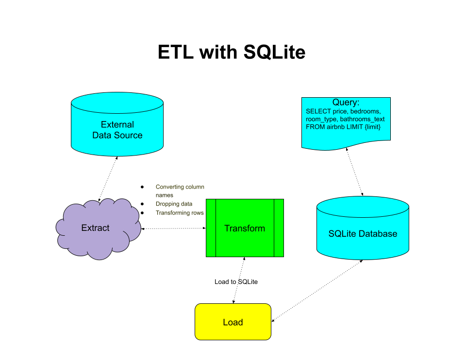
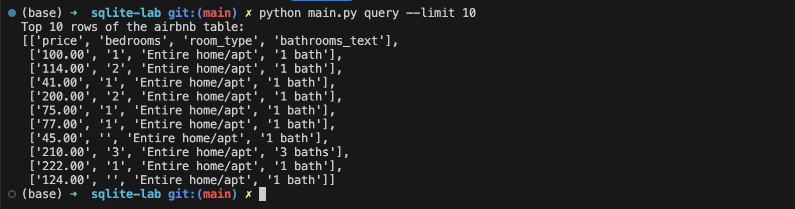

## SQLite Lab

Python Script interacting with SQL Database

### Diagram



### Files

* `mylib/extract.py` -- [E] Extract a dataset from a URL of file in CSV format as dataset.
* `mylib/transform_load.py` 
    -- [T] Transform the data by cleaning, filtering, enriching, etc to get it ready for analysis.
    -- [L] Load the transformed data into a SQLite database table using Python's sqlite3 module.
* `mylib/query.py` -- [Q] Write and execute SQL queries on the SQLite database to analyze and retrieve insights from the data.
* `main.py` -- [E] [T] [L] [Q] Run the ETL process end-to-end using fire to parse command-line arguments.
* `dataset/listings.csv` -- The dataset used in this lab. It contains information about Airbnb listings.
* `airbnb.db` -- The SQLite database created by the ETL process.

### Main.py

Using the fire module to parse command-line arguments, the main.py script runs the ETL process end-to-end. It extracts the dataset from a CSV file, transforms it by cleaning and filtering the data, loads it into a SQLite database, and runs queries on the database to analyze and retrieve insights from the data.

```python
"""
ETL-Query script
"""
import fire
from mylib.extract import extract
from mylib.transform_load import load
from mylib.query import query

class QueryCLI:
    def extract(self):
        """Extract data from source"""
        extract()

    def transform_load(self):
        """Transform and load data into target"""
        load()

    def query(self, limit=5):
        """Query the target database for the top N rows"""
        query(limit)
...
```

### Extract.py

The extract.py script extracts the dataset from a CSV file and returns the dataset file path.

```python
"""
Extract a dataset from a URL like Kaggle or data.gov. JSON or CSV formats 

"""
...
def extract(
    url="https://anlane611.github.io/ids702-fall23/DAA/listings.csv",
    file_path="dataset/listings.csv",
):
    """ "Extract a url to a file path"""
    with requests.get(url) as r:
        with open(file_path, "wb") as f:
            f.write(r.content)
    return file_path
...
```

### Transform_load.py

The transform_load.py script transforms the data by cleaning and filtering it, e.g. removing '$' from price column,  then loads it into a SQLite database table using Python's sqlite3 module.

```python
...
def load(dataset="dataset/listings.csv"):
    """Transforms and Loads data into the local SQLite3 database"""

    with open(dataset, newline="") as csvfile:
        reader = csv.reader(csvfile)
        columns = next(reader)

    with sqlite3.connect("airbnb.db") as conn:
        conn.execute("DROP TABLE IF EXISTS airbnb")

        # generate CREATE TABLE statement dynamically
        create_table = f"CREATE TABLE airbnb ({', '.join(columns)})"
        conn.execute(create_table)

        # insert data into table
        with open(dataset, newline="") as csvfile:
            reader = csv.reader(csvfile)
            next(reader)  # skip header row
            for row in reader:
                # remove $ from price column
                row[40] = row[40].replace("$", "")
                placeholders = ",".join(["?"] * len(row))
                insert_stmt = f"INSERT INTO airbnb VALUES ({placeholders})"
                conn.execute(insert_stmt, row)

    return "airbnb.db"
...
```

### Query.py
The query.py script writes and executes SQL queries on the SQLite database to analyze and retrieve insights from the data.

```python
...
def query(limit=5):
    """Query the database for the top N rows of the airbnb table"""
    conn = sqlite3.connect("airbnb.db")
    cursor = conn.cursor()
    cursor.execute(
        f"SELECT price, bedrooms, room_type, bathrooms_text FROM airbnb LIMIT {limit}"
    )
    rows = cursor.fetchall()
    print(f"Top {limit} rows of the airbnb table:")
    column_names = [description[0] for description in cursor.description]
    output = [column_names] + [[row[i] for i in range(len(row))] for row in rows]
    pprint(output)
    conn.close()
    return "Success"
...
```

### Results

By running `python main.py query --limit 10`, it will return the top 10 rows of the airbnb table.



